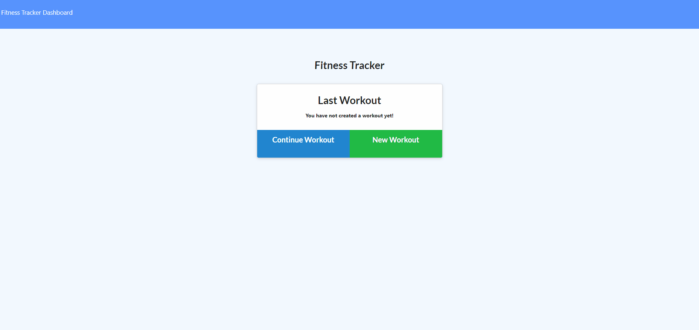

# Mongoose_WorkoutTracker

[](https://opensource.org/licenses/MIT)

Explore the [Project Page](https://github.com/Alischrec/Mongoose_WorkoutTracker)

Check out the app [here](https://safe-fjord-74005.herokuapp.com/)

## Table of Contents

* [About the Project](#about-the-project)
  * [JavaScript](#JavaScript)
  * [Assets](#Assets)
  * [Built With](#built-with)
* [Getting Started](#getting-started)
  * [Prerequisites](#prerequisites)
  * [Installation](#installation)
* [Roadmap](#roadmap)
* [Contributing](#contributing)
* [Contact](#contact)
* [Acknowledgements](#acknowledgements)

## About the Project:
The focus of this project was to build a Fitness Tracker application using Node packages and a MongoDB database. 



### JavaScript:
* [Server.js](https://github.com/Alischrec/Mongoose_WorkoutTracker/blob/main/server.js)

### Assets:
* [CSS](https://github.com/Alischrec/Mongoose_WorkoutTracker/blob/main/public/style/style.css)
* [JS](https://github.com/Alischrec/Mongoose_WorkoutTracker/tree/main/public/js)
* [Seed Data](https://github.com/Alischrec/Mongoose_WorkoutTracker/tree/main/seeders)

### Built With:
* This app is build upon [Node.js](https://nodejs.org/en/), [Express package](https://expressjs.com/), [MongoDB](https://www.mongodb.com/), and [Mongoose](https://mongoosejs.com/).

## Getting Started:
To get a local copy up and running follow the steps below.

### Prerequisites:
None.

### Installation:
1. Clone the Repository:
```sh
git clone git@github.com:Alischrec/Mongoose_WorkoutTracker.git
```

## Roadmap:
Currently no known issues, but track track [open issues](https://github.com/Alischrec/Mongoose_WorkoutTracker/issues ) for proposed features (and known issues) in the future.


## Contributing:
Any contributions you make are **greatly appreciated**.

1. Fork the Project
2. Create your Feature Branch (`git checkout -b feature/AmazingFeature`)
3. Commit your Changes (`git commit -m 'Add some AmazingFeature'`)
4. Push to the Branch (`git push origin feature/AmazingFeature`)
5. Open a Pull Request

## Contact:
Ali-Schreck. - [@alischrec](https://www.instagram.com/alischrec) - alischreck@gmail.com

Project Link: [https://github.com/Alischrec/Mongoose_WorkoutTracker](https://github.com/Alischrec/Mongoose_WorkoutTracker)

## Acknowledgements: 
* University of Washington Coding Bootcamp for providing me with the skills and knowledge to create this project. 